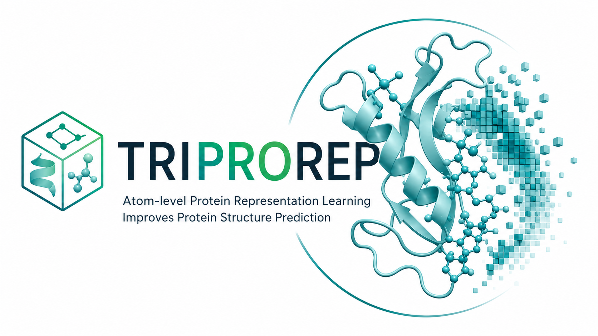

<p align="center">
  
</p>

# TriProRep

Structure-aware protein encoders pre-trained with an ELECTRA-style corrective
MLM objective on protein structures, plus a per-residue representation
benchmark covering apo-conditioned co-folding, REPA-supervised folding, and
frozen probing.

Paper: [Atom-level Protein Representation Learning Improves Protein Structure Prediction](https://arxiv.org/abs/2605.22133) (arXiv:2605.22133).

## Abstract

> Recent advances in generative modeling show that pretrained representations
> can improve generation as conditioning features or alignment targets.
> Motivated by this, we study protein representations for predicting
> structures beyond conventional function annotation. We propose TriProRep,
> a structure-aware pretraining method that jointly models three aligned
> residue-level views: amino-acid identity, backbone geometry, and local
> full-atom geometry, discretely encoded via VQ-VAE tokenizers. By
> pretraining to recover original tokens from generator-corrupted views,
> TriProRep learns to distinguish plausible but incorrect cross-view
> augmentations from the original protein. We further introduce RepSP,
> a benchmark for evaluating protein representations in structure-predictive
> settings. RepSP tests three uses of representations: homodimer co-folding
> from apo-chain representations, residue-level prediction of
> homodimer-derived interaction properties, and representation-aligned
> monomer structure prediction. Across these tasks, TriProRep improves over
> sequence-only and prior structure-aware representation models, while
> maintaining competitive performance on conventional benchmarks.

## Quickstart

```bash
pip install torch huggingface_hub omegaconf numpy lmdb biotite
git clone https://github.com/hsjang0/TriProRep.git
cd TriProRep
```

```python
import sys; sys.path.insert(0, "code/triprorep")
from inference import load_encoder, embed_pdb

encoder  = load_encoder("650M", hf_repo="k-fold-structure/triprorep-650M")
features = embed_pdb(encoder, "your_protein.pdb",
                     hf_repo="k-fold-structure/triprorep-650M")
print(features.shape)   # (L, D) fp16
```

If you already have `(seq, bb, fa)` token IDs, call `encode(encoder, seq, bb, fa)`
directly. For CPU inference, pass `device="cpu"` to `load_encoder`.

## What can you do with this release?

Four common entry points. Pick the one that matches your goal.

| Goal | Section |
|---|---|
| Embed **your** PDBs with **our** encoder | [Embed your own PDBs](#1-embed-your-own-pdbs) |
| Get **our** seq/bb/fa **tokens** for **your** PDBs | [Tokenize your own PDBs](#2-tokenize-your-own-pdbs) |
| Run **your** encoder on **our** benchmark | [Score your encoder on the benchmark](#3-score-your-encoder-on-the-benchmark) |
| Reproduce **our** benchmark numbers | [Reproduce the benchmark](#4-reproduce-the-benchmark) |

### 1. Embed your own PDBs

One protein:

```python
import sys; sys.path.insert(0, "code/triprorep")
from inference import load_encoder, embed_pdb

encoder  = load_encoder("650M", hf_repo="k-fold-structure/triprorep-650M")
features = embed_pdb(encoder, "your_protein.pdb")     # (L, 1280) fp16
```

Whole directory → one LMDB:

```bash
python examples/extract_features_from_pdbs.py \
    --pdbs_dir ./my_pdbs --pdb_glob "*.pdb" \
    --model 650M --output ./features.lmdb
```

LMDB key = PDB stem, value = `pickle.dumps(np.ndarray[L, D], dtype=fp16)`.
Chain A only; if your PDB has multiple chains, pass `chain="X"` to `embed_pdb`.

### 2. Tokenize your own PDBs

If you just want the three discrete token streams (and not the encoder
forward), use `tokenize_pdb`. The tokens are arbitrary downstream input
for your own classifier, a generation model, a custom probe.

```python
import sys; sys.path.insert(0, "code/triprorep")
from inference import tokenize_pdb

tok = tokenize_pdb("your_protein.pdb",
                   hf_repo="k-fold-structure/triprorep-650M")
tok["seq"]   # (L,) int, ESM2-style AA token IDs
tok["bb"]    # (L,) int, backbone codebook IDs   (vocab = 512)
tok["fa"]    # (L,) int, full-atom codebook IDs  (vocab = 512)
```

The two tokenizers (`backbone_tokenizer.pt`, `fullatom_tokenizer.pt`) are
downloaded from the model repo on first call and cached. The encoder
itself is not loaded. CPU works fine and the GPU footprint stays small.

### 3. Score your encoder on the benchmark

Plug your encoder into our probing benchmark in three steps. All the
assets you need (splits, probing labels, Boltz tokens, and the raw PDBs
under `REPSP_PDB/`) live in the
[`k-fold-structure/repsp-benchmark`](https://huggingface.co/datasets/k-fold-structure/repsp-benchmark)
HF dataset. The raw PDBs are AFDB structures redistributed under CC BY 4.0
(see [Datasets](#datasets)).

```bash
# (a) Pull the benchmark assets + the PDB shards you need.
bash examples/setup_benchmark.sh

# (b) Build features.lmdb with your encoder.
#     See "Bring your own encoder" below for the on-disk schema.
python my_extract.py --pdbs ./REPSP_PDB/monomer \
                     --splits ./benchmark/splits/probing \
                     --out ./work/features_theirs.lmdb

# (c) Stage per-split tensors + probe the four homodimer tasks.
LABELS=./benchmark/probing/labels.pkl
python code/repsp/probing/homomer/__lib/extract_probing_features.py \
    --features_lmdb ./work/features_theirs.lmdb \
    --splits_dir    ./benchmark/splits/probing \
    --target_pkl    $LABELS \
    --out_dir       ./work/probing_features_theirs
for TASK in binding_site delta_sasa_mean levy_tier bond_type_plip; do
    python code/repsp/probing/homomer/__lib/probe_residue_homomer.py \
        --features_dir ./work/probing_features_theirs \
        --target_pkl   $LABELS \
        --task         $TASK \
        --run_name     theirs_$TASK
done
```

The schema (a) expects from your `my_extract.py` is in
[Bring your own encoder](#bring-your-own-encoder).

### 4. Reproduce the benchmark

Two commands. The first pulls benchmark assets and expects `./REPSP_PDB/`
already populated (see [Datasets](#datasets) below). The second runs all
four probing tasks with our encoder.

```bash
bash examples/setup_benchmark.sh
MODEL_SIZE=650M bash examples/run_benchmark.sh
```

Outputs land under `./work/results_650M/<task>.json`. Knobs:

* `MODEL_SIZE=35M | 150M | 650M | 3B`: pick encoder size.
* `PDBS_DIR=./REPSP_PDB/monomer`: point at your monomer PDB dir.
* `DEVICE=cuda:1 | cpu`: device placement.
* Resumable. Re-running skips `.pt` shards already staged.

## Models

| Model | Params | Hidden dim | Encoder layers | Heads | HuggingFace |
|---|---:|---:|---:|---:|---|
| `triprorep-35M`  |  35M |  480 | 10 | 20 | [`k-fold-structure/triprorep-35M`](https://huggingface.co/k-fold-structure/triprorep-35M) |
| `triprorep-150M` | 150M |  640 | 28 | 20 | [`k-fold-structure/triprorep-150M`](https://huggingface.co/k-fold-structure/triprorep-150M) |
| `triprorep-650M` | 650M | 1280 | 30 | 20 | [`k-fold-structure/triprorep-650M`](https://huggingface.co/k-fold-structure/triprorep-650M) |
| `triprorep-3B`   |   3B | 2560 | 33 | 40 | [`k-fold-structure/triprorep-3B`](https://huggingface.co/k-fold-structure/triprorep-3B) |

Each model repo ships the full Lightning checkpoint, the sanitized
`config.yaml`, and the two structure tokenizers
(`backbone_tokenizer.pt`, `fullatom_tokenizer.pt`). The 3B repo additionally
ships `3B_encoder.pt`, an encoder-only state dict for inference.

## Datasets

All data lives under the [`k-fold-structure`](https://huggingface.co/k-fold-structure)
HuggingFace org.

```bash
# Benchmark inputs: splits, probing labels, Boltz-tokenized apo + holo
hf download k-fold-structure/repsp-benchmark --repo-type dataset --local-dir ./benchmark
cd ./benchmark/boltz_holo_tokens && for t in shard*.tar; do tar xf "$t"; done && rm shard*.tar

# Per-protein structure tokens (apo + holo), keyed by AF-{id}
hf download k-fold-structure/repsp-triprorep-tokens --repo-type dataset --local-dir ./tokens.lmdb
cd ./tokens.lmdb && cat data.mdb.part_* > data.mdb && rm data.mdb.part_*

# Pre-training corpus (654 GB, only if re-training the encoder)
hf download k-fold-structure/triprorep-pretrain --repo-type dataset --local-dir ./pretrain.lmdb
cd ./pretrain.lmdb && cat data.mdb.part_* > data.mdb && rm data.mdb.part_*
```

### Raw PDBs (`REPSP_PDB/`)

Sharded tar.gz under `k-fold-structure/repsp-benchmark/REPSP_PDB/`.
Untarring reproduces this layout:

```
REPSP_PDB/
├── monomer/<AF-id>_monomer.pdb    # chain A (apo prediction)
└── homodimer/<AF-id>.pdb          # chain A + chain B (holo dimer)
```

The AFid in both filenames is the same homodimer identifier taken from
`splits/{folding,probing}/{train,valid,test}.txt`. Sizes:

| Shard | Records | Compressed |
|---|---:|---:|
| `monomer/valid.tar.gz` | 400 | 18 MB |
| `monomer/test.tar.gz`  | 1,000 | 45 MB |
| `monomer/train_000.tar.gz` | 390,861 | 18 GB |
| `homodimer/valid.tar.gz` | 400 | 34 MB |
| `homodimer/test.tar.gz` | 1,000 | 85 MB |
| `homodimer/train_000.tar.gz` | 390,861 | 34 GB |

For probing only, `monomer/test.tar.gz` alone is enough (about 130 MB).
For folding / co-folding training, grab the train shards as well.

Split identity is preserved as-committed: folding 390,627 / 400 / 1,000,
probing 39,100 / 400 / 1,000. The splits are LMDB-cleaned (a small number
of AFids that fail Boltz tokenization are already dropped).

The PDBs come from the AFDB-Multimer homodimer collection (predicted with
AlphaFold-Multimer / ColabFold; see
[collaborations/nvda](https://ftp.ebi.ac.uk/pub/databases/alphafold/collaborations/nvda/)
on the EBI FTP) and the corresponding apo monomers we generated with
AlphaFold-2. Both are AlphaFold Protein Structure Database content and are
redistributed here under the same [CC BY 4.0](https://creativecommons.org/licenses/by/4.0/)
terms as the upstream AlphaFold DB, with attribution to DeepMind and
EMBL-EBI (see [Acknowledgements](#acknowledgements)). If you prefer, you
can also rebuild `REPSP_PDB/` from a local checkout of the Boltz-format
structures our folding pipeline writes with `scripts/npz_to_pdb.py`.

The `boltz_*` dirs use the SimpleFold on-disk format
(`manifest.json` + `records/` + `tokens/` or `structures/`). The
workflow commands point at the extracted folders.

Per-encoder feature LMDBs and probing per-split tensors are **not** shipped.
Both are produced locally in minutes from the structure tokens and an encoder
(see [Bring your own encoder](#bring-your-own-encoder)).

| Workflow | Reads | Build first |
|---|---|---|
| Pre-training | `triprorep-pretrain`, a model repo for `config.yaml` | n/a |
| Folding (REPA) | `repsp-benchmark` (`boltz_apo_*` + `splits/folding`), a model | `features.lmdb` |
| Co-folding   | `repsp-benchmark` (`boltz_holo_*` + `splits/folding`), a model | `features.lmdb` |
| Probing      | `repsp-benchmark` (`probing/labels.pkl` + `splits/probing`), `repsp-triprorep-tokens`, a model | per-split `.pt` |

## Pre-training

Train the ELECTRA encoder on the provided tokenized LMDB.

```bash
cd code/triprorep
# Edit lmdb_dir: in configs/pretrain_650M/pretrain_electra.yaml to point at ./pretrain.lmdb
torchrun --nproc_per_node=8 experiments/train_multinode.py \
    --config configs/pretrain_650M/pretrain_electra.yaml
# Sizes: pretrain_{35M, 150M, 650M, 3B}/pretrain_electra.yaml
# Multi-node template: scripts/pretrain/650M.sh
```

## Folding (REPA)

Apo single-chain folding with REPA supervision: a per-token cosine alignment
loss pulls the trunk's mid-block hidden state toward the encoder's frozen
features. Set up the folding env once with
`bash code/repsp/folding/scripts/setup_env.sh`.

Build `features.lmdb` first (see [Bring your own encoder](#bring-your-own-encoder)).

```bash
cd code/repsp/folding

APO_TOKENS=./benchmark/boltz_apo_tokens
APO_TARGETS=./benchmark/boltz_apo_targets
SPLIT=./benchmark/splits/folding
FEATURES=./features/features.lmdb
REPA_DIM=1280     # = features.lmdb __metadata__.output_dim
REPA_W=2.0

python src/simplefold/train.py experiment=folding_v1_full \
    data.feature_paths.repa_target_s=$FEATURES \
    model.repa_target_dim=$REPA_DIM \
    model.repa_weight=$REPA_W \
    ++data.datasets.0.tokenized_dir=$APO_TOKENS \
    ++data.datasets.0.target_dir=$APO_TARGETS \
    ++data.datasets.0.manifest_path=$APO_TOKENS/manifest.json \
    ++data.datasets.0.record_list=$SPLIT/train.txt \
    ++data.datasets.0.val_record_list=$SPLIT/valid.txt \
    ++data.datasets.0.test_record_list=$SPLIT/test.txt
```

`REPA_DIM` matches the encoder hidden dim: 35M→480, 150M→640, 650M→1280, 3B→2560.
For the no-REPA baseline, drop `data.feature_paths.repa_target_s` and set
`model.repa_target_dim=0 model.repa_weight=0`.

## Co-folding (homodimer)

Apo conditioning of a [SimpleFold](https://github.com/apple/ml-simplefold)
trunk folds the holo dimer. The folding code under `code/repsp/folding/` is
adapted from SimpleFold and [Boltz](https://github.com/jwohlwend/boltz)
(both MIT, see `code/repsp/folding/LICENSE`).

Build `features.lmdb` first (same step as folding above).

```bash
cd code/repsp/folding

HOLO_TOKENS=./benchmark/boltz_holo_tokens
HOLO_TARGETS=./benchmark/boltz_holo_targets
SPLIT=./benchmark/splits/folding
FEATURES=./features/features.lmdb
APO_DIM=1280     # = features.lmdb __metadata__.output_dim

python src/simplefold/train.py experiment=cofolding_v1_full \
    data.feature_paths.apo_s=$FEATURES \
    model.architecture.apo_repr_dim=$APO_DIM \
    ++data.datasets.0.tokenized_dir=$HOLO_TOKENS \
    ++data.datasets.0.target_dir=$HOLO_TARGETS \
    ++data.datasets.0.manifest_path=$HOLO_TOKENS/manifest.json \
    ++data.datasets.0.record_list=$SPLIT/train.txt \
    ++data.datasets.0.val_record_list=$SPLIT/valid.txt \
    ++data.datasets.0.test_record_list=$SPLIT/test.txt
```

Same `train.txt` / `valid.txt` / `test.txt` lists are used for both
folding and co-folding. The AFid in each line resolves to two on-disk
files: `REPSP_PDB/monomer/<AF-id>_monomer.pdb` for the apo side and
`REPSP_PDB/homodimer/<AF-id>.pdb` for the dimer side.

## Probing

Frozen-representation, per-residue probing on four homodimer tasks:
`binding_site`, `delta_sasa_mean`, `levy_tier`, `bond_type_plip`.

For the full benchmark in one command see [Reproduce the benchmark](#4-reproduce-the-benchmark).
The block below is the underlying loop, useful when plugging a different
encoder. Build per-split `.pt` features first
(see [Bring your own encoder](#bring-your-own-encoder)).

```bash
cd code/repsp/probing/homomer

FEATURES_DIR=./probing_features        # contains train.pt / valid.pt / test.pt
LABELS=./benchmark/probing/labels.pkl

for TASK in binding_site delta_sasa_mean levy_tier bond_type_plip; do
    python __lib/probe_residue_homomer.py \
        --features_dir $FEATURES_DIR \
        --target_pkl   $LABELS \
        --task         $TASK \
        --run_name     ours_$TASK
done
```

Defaults reproduce the benchmark (10 epochs, residue batch 16,824, lr 5e-4).
Setup details are in `code/repsp/probing/homomer/PROBING_SETTING.md`.

## Bring your own encoder

Per-encoder features are built locally in two flavors. Pick the one that
matches your encoder's input:

- **From our model**: feed structure tokens
  (`repsp-triprorep-tokens`, reassembled to `./tokens.lmdb`) through our
  released encoder with `inference.load_encoder` + `encode`.
- **From raw PDBs and other model**: bring any non-ours encoder
  (ESM-2, SaProt, MIF-ST, ...) that reads raw apo monomer PDBs (AlphaFold-v2
  AFDB-Multimer monomers, see `UPLOAD_MANIFEST.md §4`). Replace the
  `your_encoder_forward(...)` body.

Both variants produce the same on-disk schema, so the workflow commands
above do not change.

### (A) `features.lmdb` (folding / co-folding)

**From our model**

```python
import sys, pickle
import lmdb
sys.path.insert(0, "code/triprorep")
from inference import load_encoder, encode

APO_LMDB = "./tokens.lmdb"
OUT_LMDB = "./features/features.lmdb"

encoder = load_encoder("650M", hf_repo="k-fold-structure/triprorep-650M")
# Local ckpt alternative:
# encoder = load_encoder("650M", ckpt="./models/650M/650M.ckpt")

apo_env = lmdb.open(APO_LMDB, readonly=True, lock=False, readahead=False)
out_env = lmdb.open(OUT_LMDB, map_size=int(1e12))
n, D = 0, None
with out_env.begin(write=True) as out_txn, apo_env.begin() as apo_txn:
    for key, raw in apo_txn.cursor():
        if key in (b"__metadata__", b"__keys__"):
            continue
        rec = pickle.loads(raw)
        feats = encode(encoder, rec["apo_seq_A"], rec["apo_bb_A"], rec["apo_fa_A"])
        D = feats.shape[1]
        out_txn.put(key, pickle.dumps(feats))
        n += 1
    out_txn.put(b"__metadata__", pickle.dumps({
        "n_samples": n, "output_dim": D, "encoder": "ours_650M", "axis": "chain_A_only",
    }))
apo_env.close(); out_env.close()
```

**From raw PDBs and other model**

```python
import pickle
from pathlib import Path
import lmdb
import numpy as np

PDB_DIR    = Path("/path/to/afdb_monomer_apo_pdb")           # UPLOAD_MANIFEST §4 (external)
SPLITS_DIR = Path("./benchmark/splits/folding")              # <split>.txt (monomer IDs)
OUT_LMDB   = "./features/features.lmdb"
ENCODER    = "your_encoder_v1"
D          = 1024

# model = YourEncoder.from_pretrained(...).eval().to("cuda")

def pid_to_pdb(pid: str) -> Path:
    return PDB_DIR / f"{pid}.pdb"                            # adjust to your AFDB layout

def your_encoder_forward(pdb_path: Path) -> np.ndarray:
    """Return chain-A features [L_A, D] fp16 from one apo PDB."""
    # feats = model.embed(str(pdb_path)).cpu().numpy()
    feats = ...
    return feats.astype(np.float16)

pids = []
for s in ("train", "valid", "test"):
    pids += [l.strip() for l in (SPLITS_DIR / f"{s}.txt").read_text().splitlines() if l.strip()]

out_env = lmdb.open(OUT_LMDB, map_size=int(1e12))
with out_env.begin(write=True) as out_txn:
    for pid in pids:
        feats = your_encoder_forward(pid_to_pdb(pid))
        out_txn.put(pid.lower().encode(), pickle.dumps(feats))
    out_txn.put(b"__metadata__", pickle.dumps({
        "n_samples": len(pids), "output_dim": D,
        "encoder": ENCODER, "axis": "chain_A_only",
    }))
out_env.close()
```

The co-folding loader tiles `A∥A` inline at load. Folding reads `[L_A, D]`
as-is.

### (B) Per-split `.pt` (probing)

The `.pt` schema:

```python
{
    "X":          torch.float16 [N_res, D],         # all chain-A residues, stacked
    "pid_slices": list of (pid, start, end),        # X[start:end] = residues of `pid`
}
```

**From our model**

```python
import sys, pickle
from pathlib import Path
import lmdb
import numpy as np
import torch
sys.path.insert(0, "code/triprorep")
from inference import load_encoder, encode

APO_LMDB   = "./tokens.lmdb"
SPLITS_DIR = Path("./benchmark/splits/probing")     # {train,valid,test}.txt
OUT_DIR    = Path("./probing_features"); OUT_DIR.mkdir(parents=True, exist_ok=True)

encoder = load_encoder("650M", hf_repo="k-fold-structure/triprorep-650M")

apo_env = lmdb.open(APO_LMDB, readonly=True, lock=False, readahead=False)
with apo_env.begin() as apo_txn:
    for split in ("train", "valid", "test"):
        pids = [l.strip() for l in
                (SPLITS_DIR / f"{split}.txt").read_text().splitlines() if l.strip()]

        per_protein = []
        for pid in pids:
            rec = pickle.loads(apo_txn.get(pid.lower().encode()))
            per_protein.append(
                encode(encoder, rec["apo_seq_A"], rec["apo_bb_A"], rec["apo_fa_A"])
            )

        X = torch.from_numpy(np.concatenate(per_protein, axis=0))
        pid_slices, offset = [], 0
        for pid, feats in zip(pids, per_protein):
            pid_slices.append((pid, offset, offset + feats.shape[0]))
            offset += feats.shape[0]

        torch.save({"X": X, "pid_slices": pid_slices}, OUT_DIR / f"{split}.pt")
        print(f"{split}: {len(pid_slices)} proteins, N_res={X.shape[0]}, D={X.shape[1]}")
apo_env.close()
```

**From raw PDBs and other model**

```python
from pathlib import Path
import numpy as np
import torch

PDB_DIR    = Path("/path/to/afdb_monomer_apo_pdb")             # UPLOAD_MANIFEST §4 (external)
SPLITS_DIR = Path("./benchmark/splits/probing")
OUT_DIR    = Path("./probing_features"); OUT_DIR.mkdir(parents=True, exist_ok=True)

# model = YourEncoder.from_pretrained(...).eval().to("cuda")

def pid_to_pdb(pid: str) -> Path:
    return PDB_DIR / f"{pid}.pdb"

def your_encoder_forward(pdb_path: Path) -> np.ndarray:
    """Return chain-A features [L_A, D] fp16 from one apo PDB."""
    # feats = model.embed(str(pdb_path)).cpu().numpy()
    feats = ...
    return feats.astype(np.float16)

for split in ("train", "valid", "test"):
    pids = [l.strip() for l in
            (SPLITS_DIR / f"{split}.txt").read_text().splitlines()
            if l.strip()]

    per_protein = [your_encoder_forward(pid_to_pdb(pid)) for pid in pids]

    X = torch.from_numpy(np.concatenate(per_protein, axis=0))
    pid_slices, offset = [], 0
    for pid, feats in zip(pids, per_protein):
        pid_slices.append((pid, offset, offset + feats.shape[0]))
        offset += feats.shape[0]

    torch.save({"X": X, "pid_slices": pid_slices}, OUT_DIR / f"{split}.pt")
```

A working reference is `code/repsp/probing/homomer/__lib/extract_probing_features.py`.

## Acknowledgements

- **Backbone tokenizer** (`backbone_tokenizer.pt`): the aminoaseed VQ-VAE
  from [StructTokenBench](https://github.com/KatarinaYuan/StructTokenBench).
- **Folding trunk + Boltz data pipeline**: code under
  `code/repsp/folding/` is adapted from
  [SimpleFold](https://github.com/apple/ml-simplefold) (Apple, MIT) and
  [Boltz](https://github.com/jwohlwend/boltz) (Wohlwend et al., MIT). See
  `code/repsp/folding/docs/ATTRIBUTION.md` and `code/repsp/folding/LICENSE`.
- **Structures under `REPSP_PDB/`**: the homodimer PDBs are AFDB-Multimer
  predictions provided by NVIDIA to the
  [AlphaFold Protein Structure Database](https://alphafold.ebi.ac.uk/)
  (Jumper et al., 2021; Varadi et al., 2022, 2024); the apo monomers are
  AlphaFold-2 single-chain predictions we generated. Both are redistributed
  under [CC BY 4.0](https://creativecommons.org/licenses/by/4.0/) with
  attribution to DeepMind and EMBL-EBI, per the AFDB
  [terms of use](https://alphafold.ebi.ac.uk/assets/Terms-of-Use.pdf).

## Citation

```bibtex
@misc{triprorep,
  title  = {Atom-level Protein Representation Learning Improves Protein Structure Prediction},
  author = {Kim, Taewon and Jang, Hyosoon and Seo, Hyunjin and Seo, Seonghwan and Kim, Hyeongwoo and Zhung, Wonho and Shin, Mingyeong and Kim, Wooyoun and Ahn, Sungsoo},
  year   = {2026},
  eprint = {2605.22133},
  archivePrefix = {arXiv},
  primaryClass = {cs.LG},
  url    = {https://arxiv.org/abs/2605.22133}
}
```

## License

MIT. See `LICENSE`.
